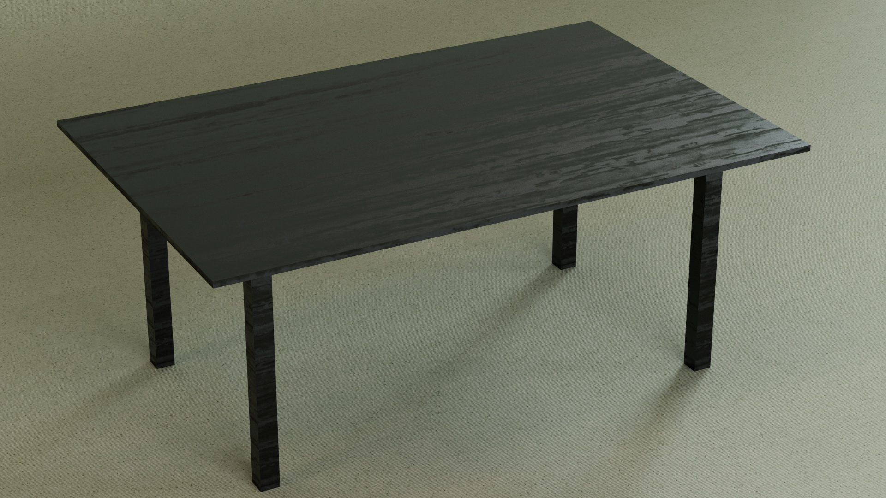
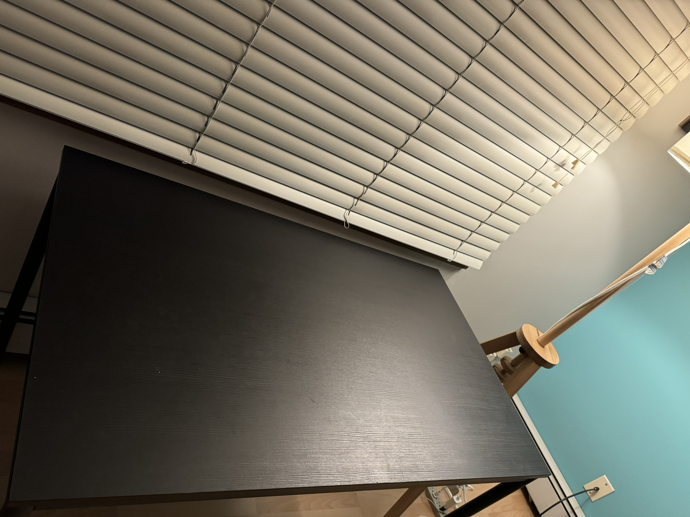
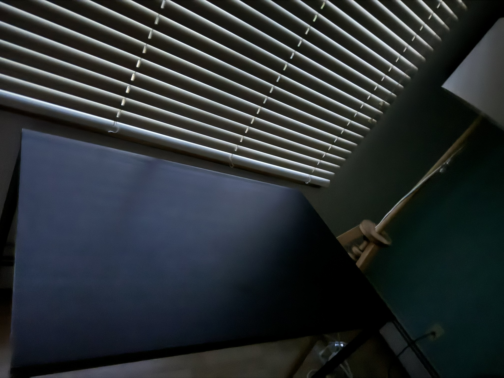

My personal project which is getting roughness of material based on light reflection from photos captured by iPhone! 

Algorithms and physics behind this will be posted in a journal soon!

What You need to do is taking a photo with light!

Next, taking a photo without light!

